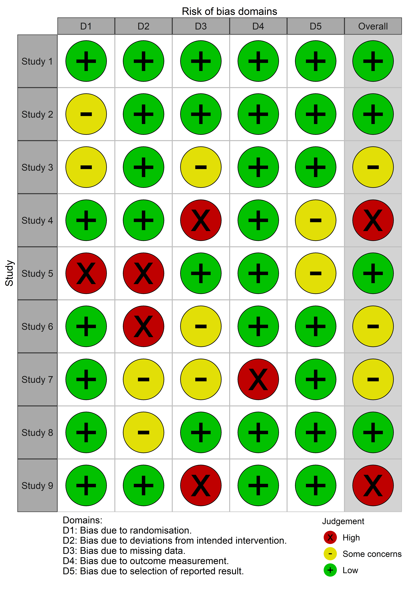

<!-- README.md is generated from README.Rmd. Please edit that file -->

```{r setup, include = FALSE}
knitr::opts_chunk$set(
  collapse = TRUE,
  comment = "#>",
  fig.path = "man/figures/README-", 
  out.width = "90%",
  fig.width= 12,
  fig.height=3)
```
# robvis 


[](https://www.repostatus.org/#active)
[](https://cran.r-project.org/web/packages/robvis/index.html)
[](https://cran.r-project.org/web/packages/robvis/index.html)
<br>
[](https://travis-ci.com/mcguinlu/robvis) 
[](https://ci.appveyor.com/project/mcguinlu/robvis)
[](https://codecov.io/gh/mcguinlu/robvis?branch=master)
<br>
[](https://doi.org/10.1002/jrsm.1411)
[](https://www.github.com/rmetaverse/metaverse)


**UPDATE**: `robvis` now exists as a [web-app](https://mcguinlu.shinyapps.io/robvis), aimed at those who are not familiar with R or who want to explore the package's functionality before installing it locally.


## Description
```{r include = FALSE}
library(robvis)

library(kableExtra)
library(magrittr)
```
The `robvis` package takes the summary table from risk-of-bias assessments and produces plots formatted according to the assessment tool used.

## Getting started

Install the development version which contains new functionality and a range of bug fixes:

```{r, eval=FALSE}   
install.packages("devtools")
devtools::install_github("mcguinlu/robvis")
```

To update the package, run the `install_github("mcguinlu/robvis")` command again.

If you wish to use the older CRAN version of the package, use the following command:

```{r, eval=FALSE}
install.packages("robvis")
```

 
### Load data
To load your own data from a .csv file:

```{r, eval=FALSE}
mydata <- read.csv("path/to/mydata.csv", header = TRUE)
```

To help users explore `robvis`, we have included example datasets in the package, one for each of the tool templates that currently exist within the package. The `data_rob2` dataset ([view it here](https://github.com/mcguinlu/robvis/blob/master/data_raw/data_rob2.csv)), which contains example risk-of-bias assessments performed using the RoB2.0 tool for randomized controlled trials, is used to create the plots in subsequent sections.

### Create plots  

The package contains two plotting functions:

#### 1. rob_summary()
Returns a ggplot object displaying a weighted barchart of the risk of bias of included studies across the domains of the specified tool. 

```{r, fig.height=3}
summary_rob <- rob_summary(data = data_rob2, tool = "ROB2")
summary_rob
```

#### 2. rob_traffic_light()
Returns a ggplot object displaying a ["traffic light plot"](https://handbook-5-1.cochrane.org/chapter_8/figure_8_6_c_example_of_a_risk_of_bias_summary_figure.htm), displaying the risk of bias judgment in each domain for each study.

```{r, eval=FALSE}
trafficlight_rob <- rob_traffic_light(data = data_rob2, tool = "ROB2")
trafficlight_rob
```

``` {r, include=FALSE}
trafficlight_rob <- rob_traffic_light(data = data_rob2, tool = "ROB2")
rob_save(trafficlight_rob,"man/figures/rob2trafficlight.png")
```
<div style="text-align:center"></div>

### Other functions

#### rob_save()
Pass the `robvis` to this function, along with a destination file, to save your risk-of-bias plots using sensible defaults.

```{r, eval = FALSE}
rob_save(trafficlight_rob, "rob_fig.png")
```

#### rob_tools()
Outputs a list of the risk of bias assessment tools for which a template currently exists in rob_summary(). We expect this list to be updated in the near future to include tools such as ROBIS (tool for assessing risk of bias in systematic reviews).

```{r}
rob_tools()
```

## Advanced usage
### Change the colour scheme
The `colour` argument of both plotting functions allows users to select from two predefined colour schemes ("cochrane" or "colourblind") or to define their own palette by providing a vector of hex codes.

For example, to use the predefined "colourblind" palette:

```{r, fig.height=3}
summary_rob <- rob_summary(data = data_rob2,
                           tool = "ROB2",
                           colour = "colourblind")
summary_rob
```

And to define your own colour scheme:
```{r, fig.height=3}
summary_rob <- rob_summary(data = data_rob2,
                           tool = "ROB2",
                           colour = c("#f442c8",
                                      "#bef441",
                                      "#000000",
                                      "#d16684"))
summary_rob
```

### Created an unweighted summary barplot
By default, the `rob_summary()` function creates a barplot weighted by some measure of a study's precision. This can be prevented using the "weighted" argument. For example, compare the following two plots:

```{r, fig.height=3}
summary_rob <- rob_summary(data = data_rob2, tool = "ROB2")
summary_rob
```

```{r, fig.height=3}
summary_rob <- rob_summary(data = data_rob2, tool = "ROB2", weighted = FALSE)
summary_rob
```

### Editing the plots
Finally, because the output (`summary_rob` and `trafficlight_rob` in the examples above) is a ggplot2 object, it is easy to adjust the plot to your own preferences.

For example, to add a title to the unweighted RoB2.0 plot created above:
```{r warning=FALSE, fig.height=3}
library(ggplot2)

summary_rob +
  ggtitle("Summary of RoB2.0 assessments")
```

## Examples of `robvis` in published papers

* Perivoliotis, Konstantinos, et al. "[Comparing the efficacy and safety of laparoscopic and robotic adrenalectomy: a meta-analysis and trial sequential analysis.](https://link.springer.com/article/10.1007/s00423-020-01860-9)" Langenbeck's Archives of Surgery (2020): 1-11.
* Adile, Ashley A., et al. "[Salvage therapy for progressive, treatment-refractory or recurrent pediatric medulloblastoma: a systematic review protocol.](https://systematicreviewsjournal.biomedcentral.com/articles/10.1186/s13643-020-01307-8)" Systematic Reviews 9.1 (2020): 1-9.
* Tanneru, Karthik, et al. "[Meta-analysis and systematic review of intermediate-term follow-up of prostatic urethral lift for benign prostatic hyperplasia.](https://link.springer.com/article/10.1007/s11255-020-02408-y)" International Urology and Nephrology (2020): 1-10.
* Veloso, Andreia, et al.. "[Effectiveness of Cognitive Training for School-Aged Children and Adolescents With Attention Deficit/Hyperactivity Disorder: A Systematic Review.](https://www.frontiersin.org/articles/10.3389/fpsyg.2019.02983/full)" Frontiers in Psychology 10 (2020): 2983.
* Simillis, Constantinos, et al. "[Postoperative chemotherapy improves survival in patients with resected high‐risk stage II colorectal cancer: results of a systematic review and meta‐analysis.](https://onlinelibrary.wiley.com/doi/pdf/10.1111/codi.14994)" Colorectal Disease (2020).
* Habadi, Mohammed Ibrahim, et al. "[Prevalence of Panic Disorders in the Primary Health Care Setting: A Systematic Review and Meta-Analysis.](https://www.ecronicon.com/ecmi/pdf/prevalence-of-panic-disorders-in-the-primary-health-care-setting-a-systematic-review-and-meta-analysis.pdf)" EC Microbiology 16.1 (2019): 01-09.
* Gibb, Kate, et al. "[The consistent burden in published estimates of delirium occurrence in medical inpatients over four decades: a systematic review and meta-analysis study.](https://www.medrxiv.org/content/medrxiv/early/2019/08/29/19005165.full.pdf)" medRxiv (2019): 19005165.

See more [here](https://scholar.google.com/scholar?cites=12564214960529060925&as_sdt=2005&sciodt=0,5&hl=en). 

## Code of conduct

Please note that the 'robvis' project is released with a
[Contributor Code of Conduct](https://github.com/mcguinlu/robvis/blob/master/CODE_OF_CONDUCT.md).
By contributing to this project, you agree to abide by its terms.

## License

This project is licensed under the MIT License - see the [LICENSE.md](https://github.com/mcguinlu/robvis/blob/master/LICENSE) file for details.

## Acknowledgments

* The `rob_summary()` function was based on code forwarded by a colleague. I recently discovered that this code was adapted from that presented in the wonderful "[Doing Meta-Analysis in R](https://bookdown.org/MathiasHarrer/Doing_Meta_Analysis_in_R/plotting-the-summary.html)" guide, so I would like to acknowledge the authors here. 
* [Emily Kothe](https://github.com/ekothe) for help in fixing `ggplot2` coding issues.
* [Eliza Grames](https://github.com/elizagrames) for creating the `robvis` hex sticker.
