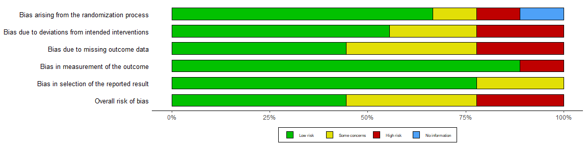
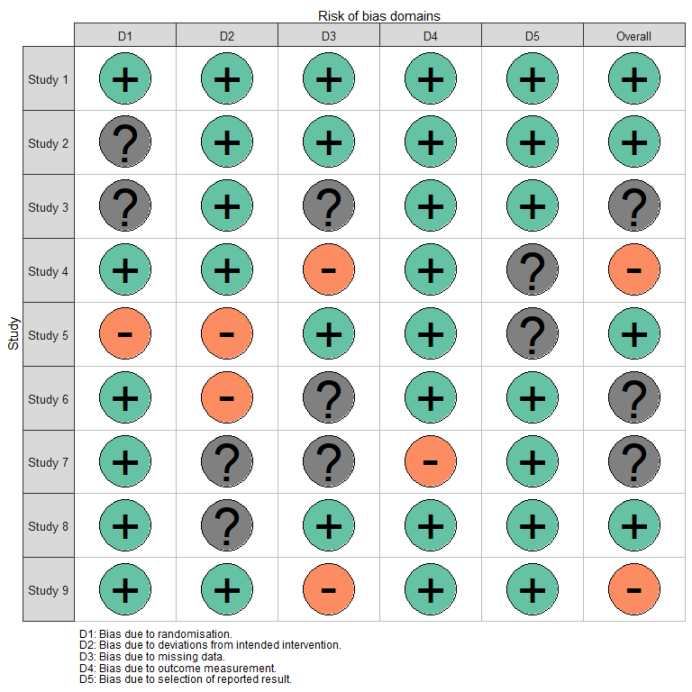
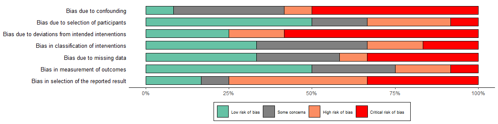
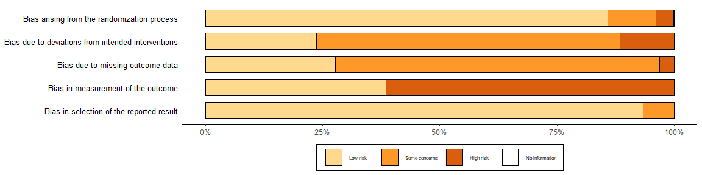
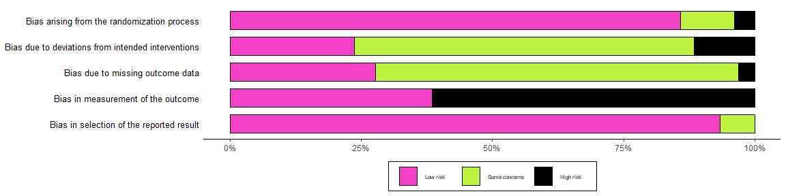

<!-- README.md is generated from README.Rmd. Please edit that file -->
`robvis`: an R pacakge for quick visualisation of risk-of-bias assessment results
=================================================================================

[](https://www.repostatus.org/#active) [](https://travis-ci.org/mcguinlu/robvis)

Description
-----------

The `robvis` package takes the summary table from risk-of-bias assessments, converts it to tidy data, produces a summary plot (incorporating some measure of weighting for each study), and formats the plot according to the assessment tool used.

The package contains two functions:

### rob\_summary()

Returns a ggplot object displaying a weighted barchart of the risk of bias of included studies across the domains of the specified tool.

### rob\_summary\_tools()

Outputs a list of the risk of bias assessment tools for which a template currently exists in rob\_suumary(). Users can currently produce summary plots for three commonly used tools: ROB2.0, ROBINS-I and QUADAS-2. We expect this list to be updated in the near future to inlcude tools such as ROBIS (tool for assessing risk of bias in systematic reviews).

    rob_summary_tools()
    [1] "ROB2"
    [1] "ROBINS-I"
    [1] "QUADAS-2"

Getting started
---------------

### Install the `robvis` R package

First ensure you have the `devtools` package installed:

``` r
install.packages("devtools")
library(devtools)
```

Then, to install:

``` r
install_github("mcguinlu/robvis")
library(robvis)
```

To update the package, run the `install_github("mcguinlu/robvis")` command again.

### Load data

Load your own data (mostly likely from a .csv)

``` r
mydata <- read.csv("path/to/mydata.csv", header = TRUE)
```

To familiarise users with the package, we have included three example datasets, one for each fo the tool templates that currently exist within `rob_summary()`. These datasets are used to create the example plots below.

### Create basic plots

**For the RoB2.0 tool for randomized controlled trials:**

``` r
plot_rob <- rob_summary(data = data_rob, tool = "ROB2")
plot_rob
```



**For the ROBINS-I tool for non-randomised studies of interventions:**

``` r
plot_robins <- rob_summary(data = data_robins, tool = "ROBINS-I")
plot_robins
```



**For the QUADAS-2 tool for diagnostic accuracy studies:**

``` r
plot_quadas <- rob_summary(data = data_quadas, tool = "QUADAS-2")
plot_quadas
```



### Include overall risk-of-bias judgements

``` r
plot_rob <- rob_summary(data = data_robins, tool = "ROBINS-I", overall = TRUE)
plot_rob
```



Additional usage
----------------

Because the output (`plot` in the above examples) is a ggplot2 object, it is easy to adjust the plot to your own preferences.

For example, to add a title to the RoB2.0 plot created above:

``` r
library(ggplot2)

plot_rob +
  ggtitle("Summary of RoB2.0 assessments")
```



License
-------

This project is licensed under the MIT License - see the [LICENSE.md](LICENSE.md) file for details

Acknowledgments
---------------

-   Emily Kothe for contribution to `ggplot2` coding issues
