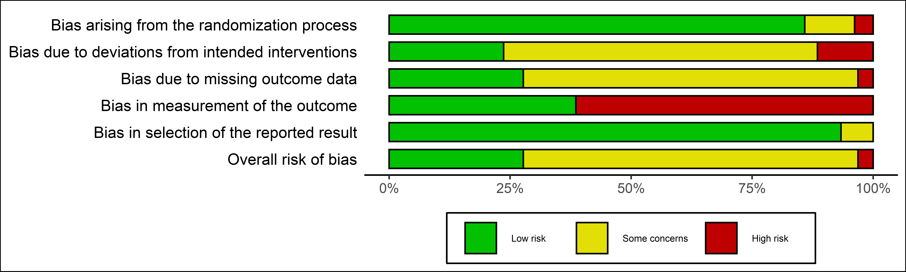

``` {r, echo = FALSE}
library(robvis)

knitr::opts_chunk$set(eval=FALSE)

```


# Front Matter
__Title: __  
Developing visualization tools with R and Shiny: a case study of the new Risk of Bias visualization tool.

&nbsp;

__Authors and Affliations__

Luke A McGuinness^1,2^ (ORCID: 0000-0001-8730-9761), 
Julian PT Higgins^1,2^ (ORCID: 0000-0002-8323-2514)

(1) MRC University of Bristol Integrative Epidemiology Unit, Bristol, UK
(2) Bristol Medical School: Population Health Sciences, University of Bristol, Bristol, UK

&nbsp;

__Corresponding author:__  

Luke McGuinness; Bristol Medical School, University of Bristol,
Canynge Hall, 39 Whatley Road, Bristol, BS8 2PS, United Kingdom.; luke.mcguinness@bristol.ac.uk

&nbsp;

__Article type__

_Computational Tools and Methods_

&nbsp;

__Funding__


LAM is supported by an NIHR Doctoral Research Fellowship (DRF-2018-11-ST2-048). Attendence at the Evidence Synthesis Hackathon in April 2019 was supported by a grant from the Evidence Synthesis Hackathon itself and the University of Bristol Alumni Foundation.


#####


# Abstract
TBC


#####

# Highlights
- No other open-source visualisation tool exists explicitly for the purpose of visualising risk of bias results
- Here we present `robvis`, an R package and `Shiny` web app for visualising risk of bias assessment results
- `robvis` allows users to procude publication quality graphics which confrom to the 
- `robvis` is completely open-source, and has benefitted from community suggested features.
- `robvis` forms part of the `metaverse`, a collection of R packages designed to provide an evidence synthesis workflow in R.

#####

# Introduction

__Intro and importance of evidence synthesis__

Evidence synthesis, the act of drawing together all relevant information to inform, is becoming more important than ever in informing policy across an increasingly wide range of fields.[@donnelly2018four] Risk of bias assessment - assessment of the internal validity of studies included in a systematic review - often forms a key part of the evidence synthesis process, particularly in the health sciences.[@higgins2008assessing] There are several well developed tools that are routinely used to produce risk of bias assessments, depending on the type of study under consideration. [@sterne2016robins; @sterne2019rob; @whiting2011quadas; @whiting2016robis] (__Worht including non-health citiations here - example welcome!__) Rather than making use of checklists or point-scoring systems, these tools are domain-based, assessing the risk of bias across a number of equally important categories. For example, the first domain in the Cochrane ROB2 tool for the assessmnt of randomised controlled trials deals with "Bias arising due to randomisation".[@sterne2019rob] Accessible graphics summarising the results of these domain-based risk-of-bias assessments are frequently produced, the two most common being weighted barplots, which show the proportion of information with each judgement for each domain in the assessment tool specified, and "traffic light" plots, which tabulate each study by each domain and provide a more detailed view of the results of the risk-of-bias assessment.[@higgins2008assessing]

However, researchers often face a number of barriers in creating such plots. While some commerical evidence synthesis platforms, such as RevMan,[@cochrane2014review] are able to produce these visualisations, not all researchers use these systems to conduct their systematic reviews, meaning that copying the risk of bias data into these systems simply to produce the plots is inefficient and error prone. Likewise, creating the figures by hand, through software such as MS PowerPoint or Adobe Illustrator, may lead to unintentional errors and require the plots to be redrawn during an (increasingly common) update to the review. 

A further barrier is that in recent years, the field of evidence synthesis software has grown rapidly,[@marshall2015systematic] but this growth has not been equally distributed across the different aspects of the systematic review process. For example, a recent review found several software offerings aimed specifcally at the abstract screening stage of the review process,[@harrison2020software] but no similar time- and error-reducing tool has been proposed for visualising the results of risk-of-bias assessments. 

Fortunately, tools such as R, RStudio and `Shiny` (an R package for building interactive web apps) have made it easier than ever to produce such a tool.[@rref;@shinyref;@rstudioref] Here, we present `robvis` (Risk Of Bias VISualiation), an R package and `Shiny` web-app that allows users to quickly create publication-ready risk-of-bias plots. While created originally for use with the major risk of bias assessment tools used in epidemiology, the tool allows users to visualise the results from any domain-based risk of bias assessment or quality appraisal tool.

The tool is open-source and available to use free of charge. Users can download a stable version of the R package from CRAN (https://cran.r-project.org/package=robvis); or access and contribute to the development version via GitHub (https://github.com/mcguinlu/robvis). Extended guidance for the tool is also available via the "Doing Meta-Analysis in R" online guide.[@mathias_harrer_2019_2551803] Below, we discuss the tools development, key functionality, and role in the evidence synthesis in R eco-system.


# Development

Development of `robvis` began in April 2019 at the Evidence Synthesis Hackathon (ESH), an event which brings together interested researchers, practitioners and coders to discuss and develop new open-source evidence synthesis technologies. Testing versions of both the R package and the web app were made available in early June 2019, with attendees of the ESH and members of the evidence synthesis research group at the University of Bristol being invited to test the tool and provide feedback. This feedback, along with other feature suggestions from the wider evidence synthesis community captured via GitHub issues, was incorporated and the first release version of the package was uploaded to CRAN in November 2019. To date, the tool has been well received and is beginning to be cited in the evidence synthesis literature.[@veloso2020effectiveness; @habadi2019prevalence; @gibb2019consistent].


# Functionality
## R package
### Tool templates and example data sets

The package works by using user-provided data to populate a predefined templates specific to the assessment tool used. These templates automatically apply the correct risk of bias domain names to the figure and label the judgement levels appropriately (e.g. "Low", "Some Concerns", "High" in the case of the ROB2 tool).

Currently, the tool contains templates for three major tools: the Cochrane RoB2 tool for assessing randomised controlled trials,[@sterne2019rob] the ROBINS-I tool for assessing non-randomized studies of interventions,[@sterne2016robins] and the QUADAS-2 tool for assessing diagnostic accuracy studies.[@whiting2011quadas] 

`robvis` also contains a general template that can be used to visualise the result of any domain-based assesssment tool. This template has greater flexibility than the tool-specific templates, allowing a variable number of domains and custom domain titles to be used. However, we would dissuade authors from viewing this as a means to create visualisations of assessments performed using adjusted versions of the tools listed above (e.g. with one or more columns removed/added). 

In order to help users familiarise themselves with the package and its functionality, `robvis` contains built-in example datasets for each template, and for illustrative purposes, the example data for the RoB2 tool for assessing risk of bias in randomised controlled trials is presented in Table \@ref(tab:robdata).

### Data import and cleaning

`robvis` expects certain facts about the risk of bias summary table we provide it (see Table \@ref(tab:robdata) for an example of a correctly formatted data set). The first column should contain the unique study/result identifier. The second-to-last column should contain the overall risk of bias judgements. The final column contains the weights (e.g. study precision or the weight assigned in a meta-anlysis). This weight column is used to create the summary barplot, as current guidance recommends dividing the bars to show the proportion of information at each level of risk of bias, determined by the cumulative weight at that level, rather than simply showing the number of studies in each category.[@cochranechpt7] 

Once imported, robvis cleans the data, corrects for small spelling errors by coverting each judgement to lowercase and taking only the first letter (e.g. "Seriuos" becomes "s", avoiding a potential error from the misspelling), and converts the summary table to a *long tidy format* to aid in creating the plots.

### Functions

`robvis` contains two main functions. The first, `rob_summary()`, creates a weighted barplot showing the proportion of information with each judgement for each domain in the assessment tool specified. The second, `rob_traffic_light()`, creates a traffic light plot by tabulating each study by each domain, providing a more detailed view of the results of the risk-of-bias assessment. 

A worked example using these functions is outlined below, showing the ease with which risk-of-bias plots can be created using `robvis`, while a detailed description of the additional options that can be used with each function is presented in Table  \@ref(tab:robarguments). Please note that all examples produced here are created using the stable version available from CRAN.

First, install and load the package:

&nbsp;

```{r}

install.packages("robvis")

library(robvis)

```

&nbsp;

Using the example data set (`data_rob2`) which is built into the package and is presented in Table \@ref(tab:robdata) for reference, the summary barplot shown in Figure \@ref(fig:summaryplot) is created using the following code:

&nbsp;

```{r}

    rob_summary(data = data_rob2,
                tool = "ROB2", 
                overall = TRUE)

```

&nbsp;

Similary, using the same data set, the traffic light plot shown in Figure \@ref(fig:trafficplot) is created using:

&nbsp;

``` {r}

    rob_traffic_light(data = data_rob2,
                      tool = "ROB2",
                      colour = "colourblind", 
                      psize = 15)


```

&nbsp;

### Further customisation

The `ggplot2` package in R, based on the "The Grammer of Graphics", allows users to readily create detailed grahpics using a declarative framework and was used to create the templates found in `robvis`.[@wilkinson2012grammar; @ggplot2ref] As a result, both `robvis` functions return a `ggplot` object, meaning they can be easily customised further using the `ggplot2` framework. For example, to add a title to the summary bar plot:

&nbsp;

``` {r}
    library(ggplot2)
    
    
    plot <- rob_summary(data_rob2, tool = "ROB2")
    
    plot +
    ggtitle("Summary Bar Plot")

```

&nbsp;

A full discussion of the range of post-production modifcations that can be made to the plots via the `ggplot2` package is beyond the scope of this article, though interested readers are directed towards the extensive guidance available.[@ggplot2ref]

## `Shiny` web app

Although `robvis` was originally designed for use in the command-line–based R programming environment, in order to make the tool available to those without knowledge of R, `robvis` also exists as a web-app, available via www.riskofbias.info/.[@robviswebapp]

The app was built using `Shiny`,[@shinyref] a R package which makes it easy to produce interactive web-apps, and provides a Graphical User Interface (GUI) for the `robvis`, allowing users to interact with the functions presented above without the need to download R or type any commands. Users can upload their data, choose the tool they used to perform the assessments, select a colour scheme, and define other parameters depending on whether they are producing a traffic light or summary bar plot, all through the online app.

# Discussion

`robvis` enables evidence synthesists with varying levels of ability in R to quickly produce two common risk of bias assessment figures at publication quality. While `robvis` is a stable package, there is a range of additional functionality that could be added. At present, the number of tools with a specific template included in `robvis` is limited - adding additional templates is a priority. For example, a template for ROBIS, a tool for assessing risk of bias in systematic reviews, is in developement.[@whiting2016robis] Additionally, the tool does not yet allow for the production of paired forest plots, where the risk of bias judgement is presented alongside each specific result included in the meta-analysis.[@cochranechpt7] This was initally considered to be beyond the scope of the tool, as it involves the visualisation of something other than risk of bias assessments. However, following user-driven demand, this functionality is in development and will be available in the near future. Finally, we would like to add similar functionaly as that provided by the `metafor::reporter()` function, which generates a brief paragraph of text describing the results of a meta-analysis. The future `robvis::reporter()` function would do the same, but provide a boilerplate description of the assessment tool used and the key domains at risk of bias. 

`robvis` serves a good example of the advantages of "packaging" the R scripts that evidence synthesists have created for personal use.[@wickham2015r] For example, it is likely that several other evidence synthesists have written scripts to produce similar risk of bias plots to those presented here - in fact, we personally know of at least one other research group that has done so. This duplication of time and effort is inefficient, and creating and sharing well-documented R packages represents one way to reduce this inefficiency. Taking this approach one step further, `Shiny` apps represent a straightforward way to provide a user-friendly graphical interface for a newly created package within a very short timeframe, expanding the potential pool of users of the new package to anyone with an internet connection.

Further, creating a package using R has a number of unique advantages. In the first instance, it provides access to a range of powerful tools including the `ggplot` infrastructure as demonstated above, but also `RMarkdown`, which allows you to create documents that can be rendered into a range of formats such as PDF, HTML, or Word.[@xie2018r] Additionally, and focusing specifically on evidence synthesis, building new tools as packages in R allows for easy intergration with the range of existing evidence synthesis packages. Recently, the `metaverse` project, of which `robvis` is a part, has begun to curate a collection of R packages that cover different aspects of the systematic review and meta-analysis process which, when taken together, form a cohert end-to-end open-source alternative to commerical offerings such as Covidence or RevMan. Key offerings in this suite of packages include `litsearcher`, which facilitates systematic search strategy development, `revtools`, a package for managing the review process and performing title and abstract screening, and `metafor`, a package for conducting meta-analyses in R.[@grames2019automated; @westgate2019revtools; @metaforref] 

#####

# Back Matter
## Acknowledgments

The following people provided valuable feedback that contributed to the development of the `robvis` tool: Emily Kothe,  Eliza Grames, Matthew Page, Alexandra Bannach-Brown, Kyle Hamilton, Charles Gray, Vincent Cheng, Wouter van Amsterdamn, Neal Haddaway and Martin Westgate.

## Code/Data availability statement
The software and data presented in this paper are freely available on GitHub: https://github.com/mcguinlu/robvis 
#####

# Tables/Figures 

```{r robdata, echo = FALSE, eval = TRUE}

plotdata <- data_rob2

knitr::kable(plotdata, caption = "Example dataset for the ROB2 tool contained within `robvis`")

```

#####


``` {r robarguments, echo = FALSE, eval = TRUE}

arguments <- data.frame(stringsAsFactors=FALSE,
              argument = c("data", "tool", "colour", "overall", "weighted",
                           "psize"),
           rob_summary = c("X", "X", "X", "X", "X", ""),
     rob_traffic_light = c("X", "X", "X", "", "", "X"),
           Description = c("Defines the dataframe containing the summary (domain) level risk-of-bias assessments. See the text and Table 1 for the format expected by `robvis`", "Defines the risk of bias assessment tool used. The RoB2 (`tool='ROB2'`), ROBINS-I (`tool='ROBINS-I'`), and QUADAS-2 (`tool='QUADAS-2'`) assessments tools are currently supported. Other tools can be visualised using the generic template (`tool = 'ROB1'`)", "Defines the colour scheme for the plot. The default is `colour = 'cochrane'` which uses the ubiquitous Cochrane colours, while a preset option for a colour-blind friendly palette is also available (`colour = 'colourblind'`). Alternatively, users can specify their own colour scheme e.g. `colour = c('#f442c8', '#bef441', '#000000')`", "Defines whether to include an additional bar showing the distibution of overall risk of bias judgements in the summary barplot figure. Default is `overall = FALSE`.", "Defines whether weights should be used to produce the summary barplot figure. Default is `weighted = TRUE`, in line with current Cochrane Collaboration guidance.", "Defines the size of the points in the traffic light plot. Default is `psize = 20`."))

knitr::kable(arguments,
             caption = "Description of the arguments available in the two main `robvis` functions",
             align = c("l","c","c","l"),
             col.names = c("Argument","`rob_summary()`","`rob_traffic_light()`", "Description"))

```


#####

``` {r summaryplot, echo = FALSE, eval = TRUE, fig.cap = "Example risk of bias summary plot created using `robvis`"}

ggplot2::ggsave(
          filename = "figs/robsummplot.png",
          plot = robvis::rob_summary(plotdata, "ROB2", overall = TRUE) +
   ggplot2::theme(plot.background = ggplot2::element_rect(colour = "black")),
          width = 8,
          height = 2.41,
          dpi = 1000
          )



```

######

``` {r trafficplot, echo = FALSE, eval = TRUE, fig.cap = "Example risk of bias traffic light plot created using `robvis`"}

ggplot2::ggsave(
          filename = "figs/robtfplot.png",
          plot = robvis::rob_traffic_light(data = plotdata, "ROB2", psize = 15, colour = "colourblind"),
          width = 7,
          height = 8,
          dpi = 1000
          )

knitr::include_graphics("figs/robtfplot.png")
```

#####

# Bibliography
